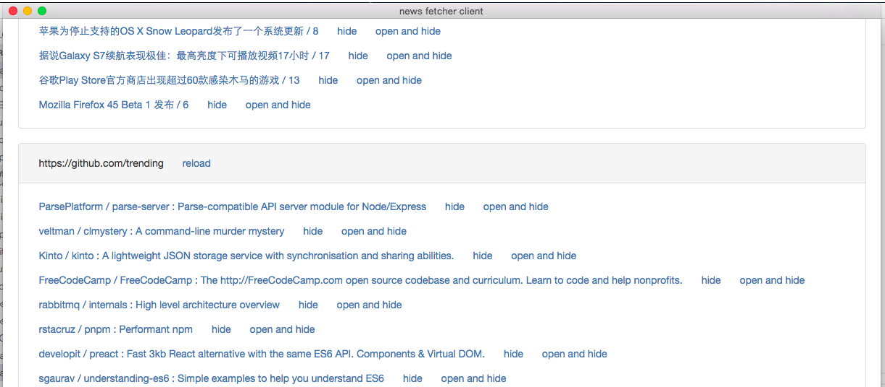

[](https://david-dm.org/plantain-00/news-fetcher-client)
[](https://david-dm.org/plantain-00/news-fetcher-client#info=devDependencies)
[](https://travis-ci.org/plantain-00/news-fetcher-client)

# tools and global npm packages

- node v4+
- electron-prebuilt
- typescript
- gulp
- electron-packager

# develop

- npm install
- tsc && gulp tslint
- electron .

# pack

## osx

- gulp pack-osx

## windows

- gulp pack-win

# usage

### it is available for windows and mac OSX, looks like:


### steps

1. pull the source code
2. install tools and global npm packages
3. run `npm install && tsc`
4. pack it for your current OS
5. if you want to sync history between different PC, you may want the server-side part: https://github.com/plantain-00/news-fetcher , and add a `secret.ts` file to keep the communication safe.

### supported urls now

1. https://v2ex.com/?tab=hot
2. http://www.cnbeta.com
3. https://github.com/trending
4. http://www.xart.com/videos
5. https://news.ycombinator.com/
6. https://cnodejs.org/?tab=all
7. https://kat.cr
8. https://eztv.ag
9. https://kat.cr/usearch/czech%20massage/?field=time_add&sorder=desc
10. and you can add more sources to `sources` in `main.ts` file, then rebuild and repack the program.

# secure: create a file of `secret.ts`, like:

```typescript
import * as settings from "./settings";

export function load() {
    settings.key = "";
}
```

to make your client communicate with your server with safety. It's not necessary if you don't want the server-side part.
